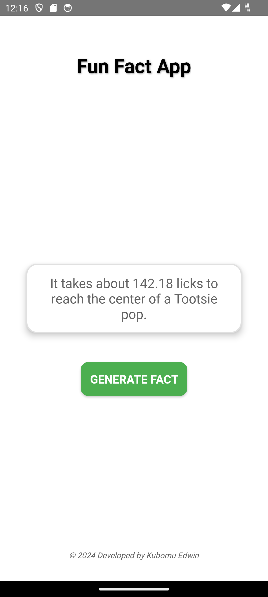
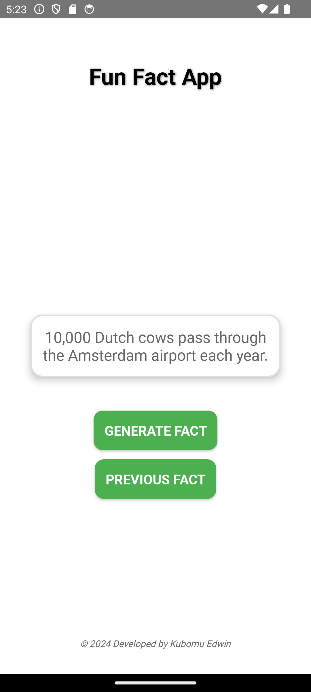
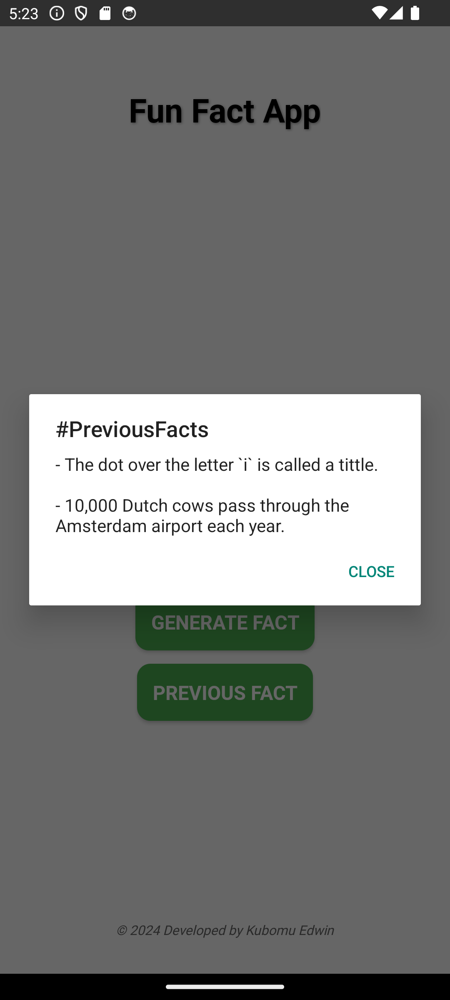

# Fun Fact Generator App

The Fun Fact Generator app is an Android application that provides users with interesting and random fun facts at the click of a button. Developed in Kotlin using Android Studio, this app offers a simple and clean design, making it easy and enjoyable to learn something new!

## Features

- **Random Fun Facts**: Generates a random fun fact with each button press.
- **User-Friendly Interface**: Minimalist and easy-to-navigate UI with a light theme.
- **Copyright Information**: Displays developer details in the footer.

## Screenshots

| Main Screen            | Fact Generation Screen       |
|------------------------|-----------------------------|
|  |  |

| Previous Facts Screen |
|------------------------|
|  |


## Technologies Used

- **Kotlin**: For the Android app development.
- **Android Studio**: The primary IDE for building the app.
- **XML**: Used for designing UI components.
  
## Getting Started

1. **Clone the Repository**:
   ```bash
   git clone https://github.com/Kubomu/FunFactGenerator.git
   ```
   
2. **Open in Android Studio**:
   - Open Android Studio.
   - Select "Open an existing project."
   - Choose the cloned repository.

3. **Run the App**:
   - Connect an Android device or start an emulator.
   - Click on the "Run" button to install and run the app.

## Usage

1. Launch the app.
2. Tap on the "Generate Fact" button.
3. Read a new fun fact each time!

## License

This project is licensed under the MIT License.

## Author

Developed by Kubomu Edwin

---

