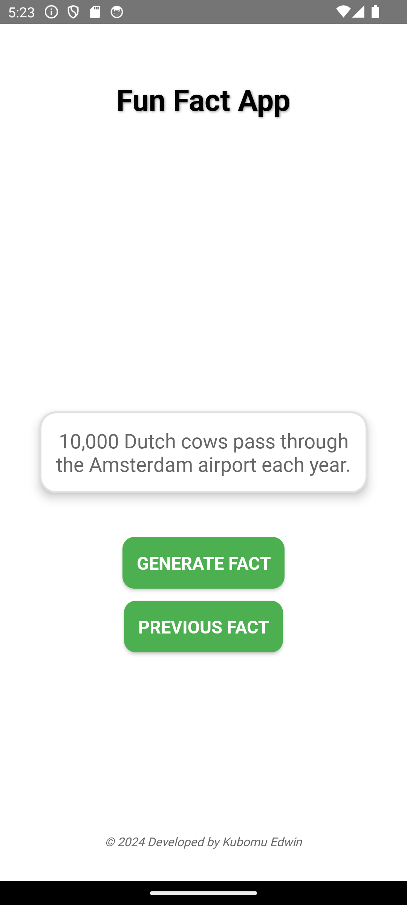
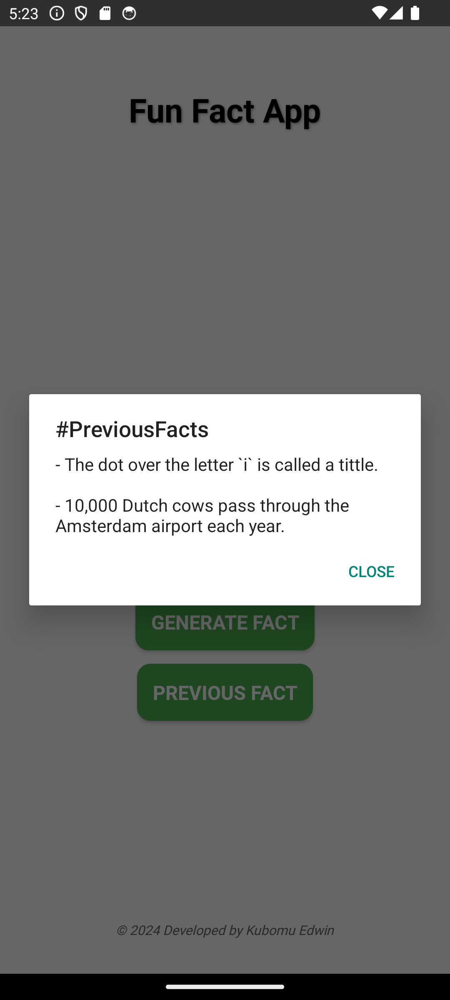

# Fun Fact Generator App

The Fun Fact Generator app is an Android application that provides users with interesting and random fun facts at the click of a button. Developed in Kotlin using Android Studio, this app offers a simple and clean design, making it easy and enjoyable to learn something new!

> This was my first Kotlin app, built in 2024 while I was learning Android development. I keep it here as a marker of where I started. It has since been given a small tune-up so it still runs today.

## Try it

The most reliable way to run the current version is to build it from source (see [Getting Started](#getting-started) below). The code has been updated to point at the facts API's current endpoint.

An installable APK from 2024 is also on the [Releases page](https://github.com/Kubomu/FunFactGenerator/releases). One honest note: the free facts API this app originally used was retired since then, so that older APK no longer loads facts. Building from the current source fixes that.

## Features

- **Random Fun Facts**: Generates a random fun fact with each button press.
- **View Previous Facts**: Allows users to view previously generated fun facts in a dialog box labeled "#PreviousFacts."
- **User-Friendly Interface**: Minimalist and easy-to-navigate UI with a light theme.
- **Copyright Information**: Displays developer details in the footer for personalization.

## Screenshots

| Fact Generation Screen/ Main Screen      |
|------------------------------------------|
|  |

| Previous Facts Screen |
|------------------------|
|  |

## Technologies Used

- **Kotlin**: For the Android app development.
- **Android Studio**: The primary IDE for building the app.
- **XML**: Used for designing UI components.
- **Retrofit**: For calling the facts API and parsing the JSON response.
- **API**: Facts come from the free [uselessfacts](https://uselessfacts.jsph.pl/) API (v2).

## Getting Started

1. **Clone the Repository**:
   ```bash
   git clone https://github.com/Kubomu/FunFactGenerator.git
   ```

2. **Open in Android Studio**:
   - Open Android Studio.
   - Select "Open an existing project."
   - Choose the cloned repository.

3. **Run the App**:
   - Connect an Android device or start an emulator.
   - Click on the "Run" button to install and run the app.

## Usage

1. Launch the app.
2. Tap on the "Generate Fact" button.
3. Read a new fun fact each time!

## License

This project is licensed under the MIT License.

## Author

Developed by Kubomu Edwin

---
